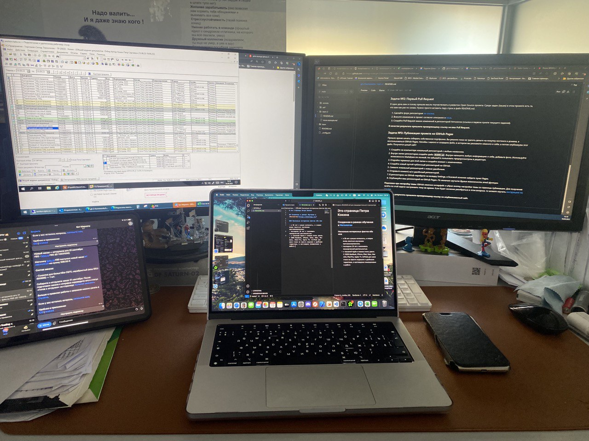
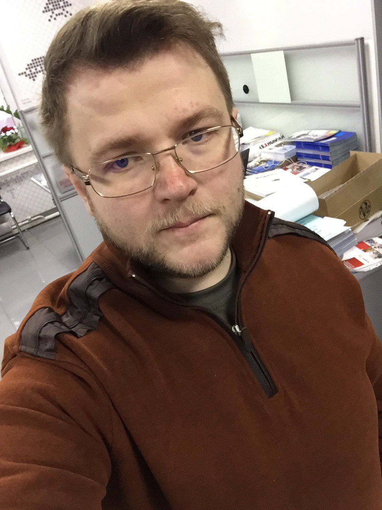

# Это страница Петра Кокина

## Созданная в рамках обучения в [Нетологии](https://netology.ru/)

### Несколько интересных фактов обо мне

- в 39 лет я решил ~~вспомнить~~, а вернее вновь заняться изучением программирования.
---
- последние 20 лет я занимаюсь коммерческой деятельностью.
---
- с техникой Apple я знаком очень давно. С 2009 MacBook, iPhone, iPad, iMac, Mac mini, iPad Pro, Apple TV, AirPods для меня стали не просто модными и удобными гаджетами, а настоящими помощниками в работе.

### Пусть это только начало пути, уже есть неоччевидные результаты:

---

1. Мне стало ***гораздо*** проще ставить задачи и взаимодействовать с разработчиками внутри моей компании.
2. Ряд процессов, в управление которыми я вовлечен, получили ***новые решения***, их прозрачность, управляемость и результат изменились в лучшую сторону. Это не связано со специальностью напрямую, но пройденные темы и процесс обучения позволили мне смотреть на типичные задачи совершенно по другому.
3. В моем календаре стало ___меньше хаоса___. Выделяя 2 часа в день на обучение, попутно удалось навести порядок с другими цикличными/регламентными задачами.

### Одна из целей моего обучения - вновь добавить программирование в список моих хобби 😍
- чтение книг.
- кино.
- путешествия.
- работа.
- и надеюсь в будущем пятым пунктом станет программирование.

### Вот так выглядел мое рабочее место во время решения домашнего задания 🤣
---

## А вот так выглядел я 🤨

